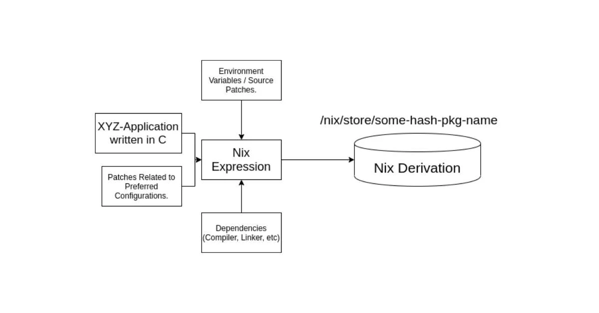

# Why Nix?

---

## Problems

- Discrepancies across multiple machines
- Multiple language versions (Java, Node, Haskell, Go)
- Shared global libraries (glibc, musl)
- Security
- Unmaintained open source projects
- Running one thing in dev and another in prod
- Building the same package many times
- N+1 package managers

---

## Package Managers

---

## Docker Solves This!

> Docker does two things, and it does both of them poorly.
>
> ~ Me

---

## Nix

Solve the package management problem first and solutions to the other problems come naturally.

---

## Purely Functional

---

---

---

